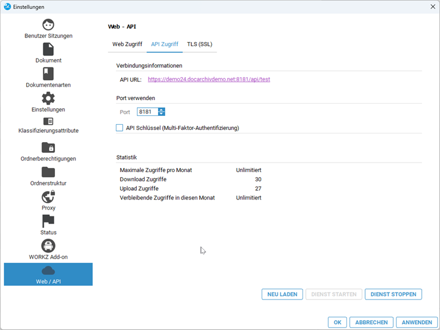
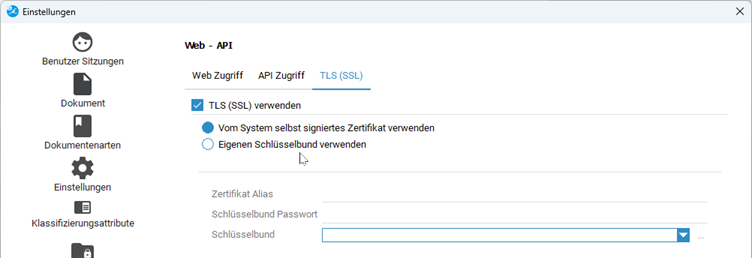
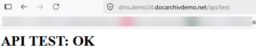

# Vorbereitung ecoDMS

### Kurzfassung
- API Schnittstelle einrichten   
In ecoDMS ist die API Schnittstelle einzurichten und zu testen.
- Klassifizierungsfelder anlegen   
Für die Steuerung der Übertragung legen Sie die Klassifizierungen fest, welche Daten übertragen werden sollen und welche Daten zurückgeschrieben werden.
- Berechtigungen für den Zugriff prüfen

!!! note "Bitte beachten Sie"
    Für den Einsatz der Software und den Export von Belegen benötigen Sie eine **ecoDMS ONE Lizenz**. Business und Privatlizenzen unterstützen keinen API Zugriff auf die Dokumente. Falls Sie ein Upgrade benötigen können Sie dies bei uns erwerben.


### API Aktivieren

in ecoDMS muss der API Zugriff aktiviert werden. 

!!! danger ""
    Wenn Sie einen **unserer Cloudserver** benutzen, bitte an den Porteinstellungen und Pfaden keine Änderung vornehmen.   
    Die Adress für die cloudserver ist immer vorne ```dms.``` und dahinter ```/api``` also z.B. ```https://dms.IHRSERVERNAME.docarchiv.de/api```  
    Sie müssen Anleitung hier nicht machen. 
    
1. **API Dienst in ecoDMS in den Einstellungen konfigurieren und starten**   

    


2. **Im Bereich Zertifikate bitte die folgenden Einstellungen vornehmen**   

    

3. **Zugriffstest ist die ecoDMS API bereit bzw. der Zugriff möglich?**   
Der Test sollte folgendes in Ihrem Browser anzeigen:

    


Zertifikatsfehler können Sie bei dem Test ignorieren, wenn Sie nur intern zugreifen.
Bei unseren Cloudinstallation wird das Zertifikat extern gesteuert.


-------------------

### Berrechtigungen setzen / prüfen
    
Auch die API greift mit einem ecodms Benutzer auf die Dokumente zu. In der Rechteverwaltung benötigt der Benutzer enstpechende Erlaubnisse. 

Der Benutzer, der den Export vornehmen soll, muss auf die zu übertragenden Dokumente Zugriff haben.    
    

Wenn Sie einen zentralen Benutzer nutzen, vermeiden Sie nach Möglichkeit die Nutzung des administrativen "ecodms" Benutzers. Legen Sie einen Neuen Benutzer mit entsprechenden Rechten an, so können Sie die Aktionen nachverfolgen.


