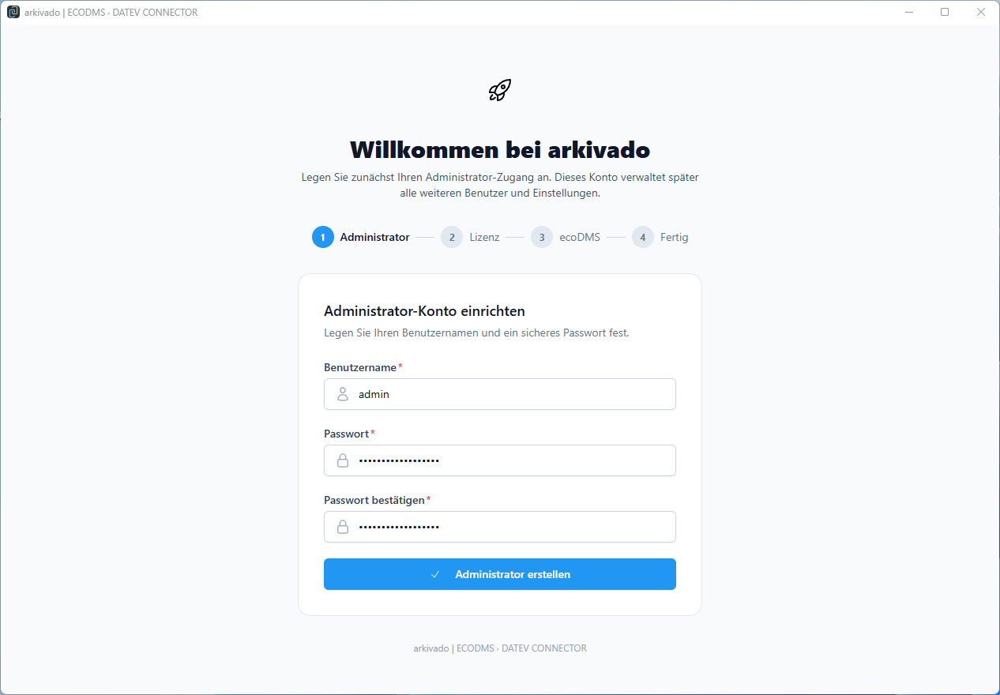

# Erster Start

Beim ersten Start werden die Grundeinstellungen für Benutzer und die Verbindung zu Ihrem ecoDMS-Server eingerichtet.

!!! note ""
    Bitte konfigurieren Sie nach Möglichkeit die API von ecoDMS vor dem ersten Aufruf der Software.
    [Konfiguration des ecoDMS API Zugriffs](vorbereitung-ecodms.md)

1. Anlage des Benutzers und des Passworts   
   
    !!! info ""
        Es handelt sich hier um den administrativen Benutzer des arkivado CONNECTORs.   
        Der Benutzer ist nicht in ecoDMS.  
       
   

2. Aktivierung der Lizenz aus der zugesandten E-Mail   
    
    

3. Zugang zu Ihrem ecoDMS-Server   
    - Voraussetzung: Die API ist in ecoDMS aktiviert.   
       Sollten Sie ecoDMS noch nicht konfiguriert haben, können Sie die Einrichtung an dieser Stelle durch Schließen des Programms und einen Neustart der Anwendung fortsetzen und den ecoDMS-Zugang später einrichten.

    - Einstellungen siehe ecoDMS-Administration ([Konfiguration des ecoDMS-API-Zugriffs](vorbereitung-ecodms.md))

4. Jetzt können Sie den Zugang zum ecoDMS-Server konfigurieren.

    

5. Nun ist der arkivado CONNECTOR bereit.    
    Weitere Einrichtungsschritte hängen davon ab was Sie wollen z.B.

       [DATEV einrichten](../datev/index.md){ .md-button .md-button--primary }
       [Mistral KI einrichten](../ki/index.md){ .md-button .md-button--primary }

