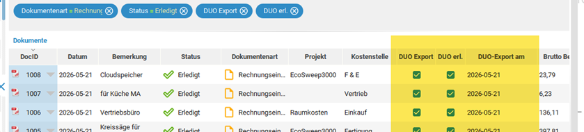

# { width="25" } arkivado ECODMS CONNECTOR   

Der Nachfolger unseres arkivado tools - jetzt mit komplett überarbeiteter Oberfläche und Konfigurationsmöglichkeit.

!!! tip "Neue Featurs"  
    -  Jetzt direktes Übetragen zu **DATEV Unternehmen Online** ohne Belegtransfer mit Kommentaren    
    -  **Mistral KI**: vollautomatisches Klassifizeren Ihrer Dokumente    
      

Enthält alles aus unserem arkivado Tool und wird fortlaufend weitere Funktionen erhalten.   
Der arkivado CONNECTOR ist unser neues Tool für die Anbindung verschiedenster Software, Cloudanbierter und KI Modelle.

## Drei Bausteine für durchgängige Dokumentenprozesse

### DATEV-Anbindung für ecoDMS

Direkt Online ***ohne Belegtransfer*** und lästiges Anmelden übertragen.   
**Schnell - Einfach - Automatisch - übersichtlich und nachvollziehbar**

Übertragen Sie freigegebene Belege direkt aus ecoDMS an DATEV Unternehmen
online. Der arkivado CONNECTOR kann die passenden Dokumente automatisiert
ermitteln, den Exportstatus in ecoDMS dokumentieren und mehrere Mandanten sowie
individuelle Filter berücksichtigen.

Dank des arkivado Connectors ist keine DATEV Belegtransfer Software oder senden per E-Mail für die DATEV Übertragung notwendig. Der Vorgang der Übertragung wird in ecoDMS mit Datum vermerkt.
So geht nichts verloren oder wird doppelt übertragen.
Dank der Markierung ist es auch nicht notwendig per Datum zu übertragen. Das System merkt sich ob Belege schon übertragen sind und setzt entsprechende Werte in ecoDMS.   

**Die Schnittstelle überträgt Belegbilder plus ein Notizfeld - es werden keine Klassifizierungen übertragen.**   
Belegbilder sind in DATEV-Sprech Belege bzw. die Dokumente (z.B. PDF, x-Rechnung oder ZUGFeRD Belege)

   

Die Übertragung kann unabhängig vom Datumsbereich fortlaufend durchgeführt werden.   
==Der Übertrag ist auch für mehrere Mandanten/Betriebe möglich==   

[Mehr zur DATEV-Anbindung](datev/index.md){ .md-button .md-button--primary }

### Mistral KI für ecoDMS

Dokumente automatisch verstehen, klassifizieren und richtig ablegen: Die
Mistral-Anbindung erkennt Dokumenttypen und relevante Inhalte, übernimmt
Klassifizierungsmerkmale und ordnet Dokumente den vorgesehenen Ordnern in
ecoDMS zu. Das reduziert manuelle Eingaben und sorgt für eine einheitliche
Ablage.

[Mehr zur Mistral KI](ki/index.md){ .md-button .md-button--primary }

### SEPA-Export für ecoDMS

Bereiten Sie Zahlungen auf Basis Ihrer archivierten Rechnungen für das
Onlinebanking vor. Bereits vorhandene Zahlungsdaten werden für den SEPA-Export
aufbereitet, wodurch sich doppelte Dateneingaben und Übertragungsfehler
reduzieren lassen. Für den passenden Export können verschiedene Banken
ausgewählt werden.

[Mehr zum SEPA-Export](sepa/index.md){ .md-button .md-button--primary }

### Weitere Funktionen

- DATEV Export/Übergabe inkl. Buchungsdaten
- SEPA Export Onlinebanking
- Frei konfigurierbare formatierte Excellisten
- Frei konfigurierbare CSV Exporte
- Export in weitere Buchhaltungsprogrammen (DATEV-Format, CSV, XML usw.)
- Zeitgesteuert oder als Dienst einsetzbar
- Weitere Exporte aus ecoDMS: Dokumente und Dokumentlisten
- Berechtigungsmatrix zu Benutzern, Rollen und Ordnerberechtigungen nach Excel
- Konfigurierbare Oberfläche   

Läuft unter Microsoft Windows lokal ohne Installation.   
Voraussetzung ist der API Zugriff mit der ecoDMS One Lizenz (API Punktepaket).   
Alle Pfade und Ablagen können individuell angepasst werden.   

Einstellungen in DATEV Unternehmen Online sind teilweise von Ihrem Steuerberater oder DATEV Partner zu konfigurieren.

